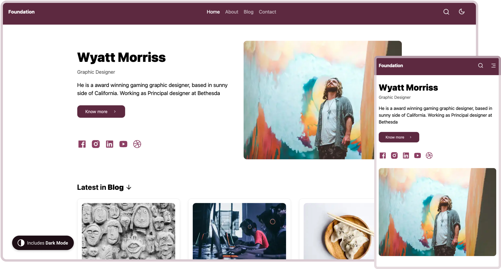
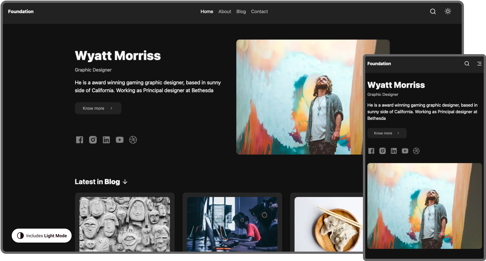

# Foundation

A starter to launch your blazing fast personal website and a blog, built with [Next.js](https://nextjs.org) and deployed on [Netlify](https://netlify.com).



## Features

- Blog and personal website
- Responsive web design
- Dark / light mode
- Search bar
- Customizable theme colors
- SEO optimized (OpenGraph, Twitter Cards, meta tags)
- Social media icons
- Netlify contact form (works out of the box)
- Blog pagination
- Previous / next post navigation
- Static site generation (fast page loads, no server required)



## Quick Start

### Install locally

```bash
git clone https://github.com/stackrole/gatsby-starter-foundation.git
cd gatsby-starter-foundation
npm install
npm run dev
```

Your site is now running at `http://localhost:3000`.

### Deploy to Netlify

Push to a Git repository and connect it to [Netlify](https://app.netlify.com). The build settings are already configured in `netlify.toml`.

## Editing Content

Content is managed as Markdown files in the `src/content/` directory. No CMS required — just edit the files directly or use the GitHub web editor.

### Blog Posts

Add or edit posts in `src/content/posts/`. Each post is a `.md` file with frontmatter:

```yaml
---
template: blog-post
title: My New Post
slug: /my-new-post
date: 2024-01-15
description: A short description for SEO
featuredImage: /assets/my-image.jpg
---

Your post content here in Markdown.
```

### Pages

Edit pages in `src/content/pages/`:

- `index.md` — Homepage (title, tagline, featured image, CTA button)
- `about.md` — About page
- `contact.md` — Contact page

### Site Settings

- `src/util/site.json` — Site title, description, URL, Twitter handle, Google Analytics
- `src/util/socialmedia.json` — Social media icons and links
- `src/util/default-colors.json` — Primary theme color (light mode)
- `src/util/dark-theme-colors.json` — Primary theme color (dark mode)

### Images

Place images in `public/assets/` and reference them as `/assets/filename.jpg` in your markdown frontmatter.

## Folder Structure

```
.
├── app/                  # Next.js App Router pages
│   ├── layout.js         # Root layout (theme provider, global styles)
│   ├── page.js           # Homepage
│   ├── not-found.js      # 404 page
│   ├── about/            # About page
│   ├── blog/             # Blog list (with pagination)
│   ├── contact/          # Contact page
│   ├── thanks/           # Form submission success
│   └── [...slug]/        # Blog post pages
├── lib/
│   ├── markdown.js       # Markdown processing (gray-matter + remark)
│   └── theme.js          # Theme UI configuration
├── src/
│   ├── assets/scss/      # SCSS stylesheets
│   ├── components/       # React components
│   ├── content/          # Markdown content (posts & pages)
│   └── util/             # Site configuration (JSON)
├── public/assets/        # Static images and media
├── next.config.js        # Next.js configuration
├── netlify.toml          # Netlify build settings
└── package.json
```

## Tech Stack

- [Next.js 14](https://nextjs.org) — React framework (App Router, static export)
- [Theme UI](https://theme-ui.com) — Styling and dark/light mode
- [SCSS](https://sass-lang.com) — Stylesheets
- [gray-matter](https://github.com/jonschlinkert/gray-matter) + [remark](https://github.com/remarkjs/remark) — Markdown processing
- [ElasticLunr](http://elasticlunr.com) — Client-side search
- [Netlify](https://netlify.com) — Hosting and contact form

## License

MIT
